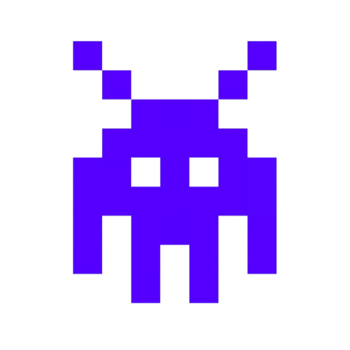

  

# CGD - Compilador Geral Delégua

Compilador para a linguagem de programação [Delegua](https://github.com/DesignLiquido/delegua).

**Versão:** `0.0.1`

## Plataformas suportadas

- Linux
- macOS
- Windows (no futuro)

## Arquitetura do compilador

O processo de compilação segue o pipeline:

1. **Análise léxica e sintática** - Processa código Delegua
2. **Geração de código** - Transpila para código D
3. **Compilação nativa** - Utiliza LDC para gerar binário final

## Dependências

- LDC (LLVM D Compiler) para geração do executável final

## Status do projeto

**Em desenvolvimento ativo**

Iniciado: 11 de agosto de 2025

### Funcionalidades implementadas

- [X] Lexer básico
  - [X] Lexer completo
- [X] Parser básico
  - [ ] Parser completo
- [X] Analisador semântico básico
  - [ ] Analisador semântico completo
- [ ] Otimizador
- [X] Gerador de código D
- [X] Geração do binário
- [ ] Tratamento de erros eficiente
- [ ] Criação de bibliotecas
  - [X] io
  - [ ] math
  - [ ] http
  - [ ] json
  - [ ] cripto

### Próximos passos

- Suporte completo ao Windows

## Contribuição

Este projeto está em fase inicial de desenvolvimento. Contribuições serão bem-vindas após a primeira versão estável.
